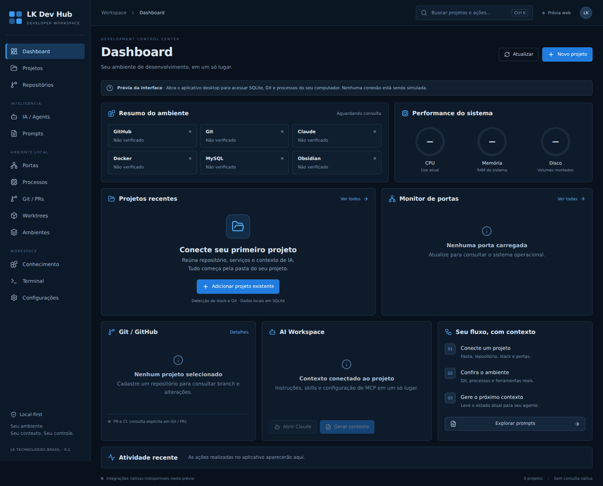

# LK Dev Hub

Local developer control center da LK Technologies Brasil. Reúne projetos, Git, portas, processos e contexto de IA em uma aplicação Windows. O repositório se chama **LK-Tools**; o produto mantém o nome provisório **LK Dev Hub**.

**Estado: v0.1 foundation em desenvolvimento.** Código real, sem dados de demonstração. Build da interface e testes do núcleo são independentes da validação desktop Windows. Consulte [TASKS.md](TASKS.md) e [checkpoint](docs/CHECKPOINT.md) antes de considerar esta versão pronta para uso diário.

> **LKR LAB** — o repositório está evoluindo para o hub pessoal LKR LAB. O primeiro módulo, **Lab Setup** (checklist de estrutura e compras do laboratório), fica em [`lkr-lab/`](lkr-lab/README.md): HTML/CSS/JS puro, abre direto no navegador e é independente da aplicação desktop abaixo.



A imagem acima é a interface implementada em prévia web, sem backend nativo. O [mockup aprovado](docs/images/concept.png) é a referência visual. A aplicação começa com cadastro vazio e estados explícitos de indisponibilidade.

## Funcionalidades implementadas

- Cadastro, edição e remoção confirmada de projetos em SQLite; nunca remove a pasta.
- Descoberta de pasta, Git remote HTTPS sanitizado e stack; sem executar scripts de projeto.
- Git CLI: branch, HEAD, alterações, upstream, ahead/behind locais, commits e worktrees em leitura.
- Consultas explícitas via gh: autenticação, PRs, checks, review, mergeability e issues.
- Camadas nativas para CPU, memória, discos, processos e sockets TCP/UDP.
- Portas esperadas por projeto e associação por CWD quando disponível; expectativas nunca viram propriedade confirmada.
- Encerramento de processo com confirmação e rechecagem do start time do PID.
- Launchers de pasta, Windows Terminal, VS Code e Claude CLI nativa.
- Templates globais/por projeto, renderização de variáveis e cópia.
- Development Context: visualizar, copiar e exportar Markdown.
- Provider Claude: presença de instruções, skills e arquivo MCP sem leitura de credenciais.
- Paleta Ctrl+K, hash routing, estados vazios e histórico de alterações do cadastro/contexto.

Não implementados: execução de serviços/comandos customizados, autenticação da conta Claude, sessão IA, criação/remoção de worktrees, environment-key validation, knowledge/vault management e terminal embutido.

## Stack e arquitetura

Tauri 2 + React + TypeScript strict + Vite; Rust em `crates/hub-core`; SQLite via rusqlite bundled. CSS próprio e Lucide; sem framework visual pesado. `src-tauri` contém somente a ponte IPC e diálogos nativos. Nenhum shell genérico ou acesso direto ao banco é exposto ao renderer.

## Pré-requisitos Windows

- Node.js 22.13+ (ou 24 LTS), npm.
- Rust estável **MSVC**, Visual Studio Build Tools com **Desktop development with C++** e Windows SDK.
- Microsoft Edge WebView2 Runtime.
- Git CLI; opcionais: gh, Windows Terminal, Claude CLI nativa, Docker, MySQL CLI.
- VS Code: `code.exe` no PATH. O shim `code.cmd` não é executado nesta versão. Adicione a pasta que contém Code.exe ao PATH se necessário.

Referência: [pré-requisitos oficiais Tauri](https://v2.tauri.app/start/prerequisites/).

```powershell
npm ci
npm run tauri dev
```

A interface web isolada (`npm run dev`) é apenas uma prévia: operações nativas não funcionam no navegador e não possuem fallback falso em localStorage.

## Build e testes

```powershell
npm run typecheck
npm run lint
npm test
npm run build
cargo test -p hub-core
cargo clippy -p hub-core --all-targets -- -D warnings
cargo test -p hub-core live_port_detection_uses_read_only_socket -- --ignored
npm run tauri build
```

O teste live de portas abre apenas um listener temporário e verifica sua presença. Não encerra processos. Instalador NSIS, quando compilado, em `target/release/bundle/nsis/`.

## Estrutura

- `src/`: layout React, features, tipos e bridge IPC.
- `src-tauri/`: janela, configuração CSP, comandos permitidos e exportação.
- `crates/hub-core/`: regras, SQLite/migration, Git, providers e sistema.
- `docs/`: especificação, decisões, ameaças, roadmap e checkpoint.
- `scripts/validate-windows.ps1`: validação técnica local.
- `.github/workflows/ci.yml`: gates Windows; sem deploy nem merge automático.

## Dados e privacidade

SQLite em `app_data_dir()/hub.db` (Windows normalmente `%APPDATA%/br.com.lktechnologies.devhub/hub.db`). Sem telemetria. Campos e templates são dados locais em texto: **não cadastre segredos**. Conteúdo de `.env` não é lido. Snapshot pode conter caminhos, nomes e assuntos de commits; revise antes de compartilhar.

Nenhuma licença de redistribuição do código próprio foi escolhida. Dependências mantêm suas licenças; veja [DEPENDENCIES.md](docs/DEPENDENCIES.md).

Roadmap: [docs/ROADMAP.md](docs/ROADMAP.md).
