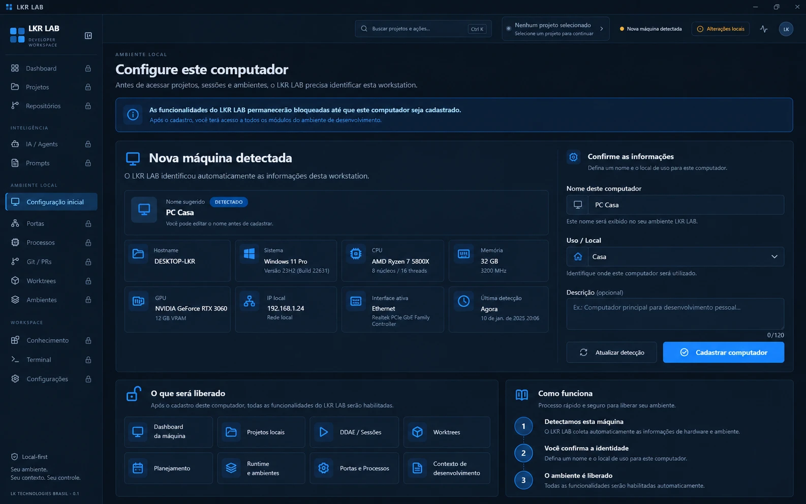

# Concept 01 — Primeiro acesso / Computador não cadastrado

**Status:** APROVADO (direção visual)
**Sessão DDAE:** [SESSION-001](../../ddae/sessions/SESSION-001-machine-context-workspace-foundation.md)
**Imagem canônica:** [concept-01-first-access.webp](concept-01-first-access.webp)



## Objetivo

Definir a experiência inicial quando o LKR LAB é executado em uma máquina ainda não cadastrada.

Este concept absorveu o que seria um concept separado de "cadastro do computador". Não existe outro concept só para cadastro.

## Conteúdo do concept

- LKR LAB aberto em uma máquina ainda não cadastrada.
- Sidebar visível, com os módulos bloqueados (cadeado).
- Detecção automática da máquina: hostname, sistema, CPU, memória, GPU, IP local, interface ativa e última detecção.
- Formulário para confirmar a identidade: nome amigável, uso/local e descrição opcional.
- CTA "Cadastrar computador" e ação secundária "Atualizar detecção".
- Explicação do que será liberado após o cadastro e de como o processo funciona.

## Regras canônicas

1. O computador é a **raiz** do contexto local do LKR LAB.
2. Antes de liberar qualquer funcionalidade, o LKR LAB precisa reconhecer uma máquina cadastrada.
3. Se a máquina não estiver cadastrada, ficam bloqueados: Dashboard, Projetos, Repositórios, IA / Agents, Prompts, Portas, Processos, Git / PRs, Worktrees, Ambientes, Conhecimento, Terminal e demais módulos.
4. A única experiência liberada é **Configuração inicial / Cadastro da máquina**.
5. O LKR LAB detecta automaticamente os dados possíveis da workstation.
6. O usuário complementa apenas informações semânticas que o sistema não infere com segurança (nome amigável, ex.: "PC Casa"; local/uso, ex.: "Casa"; descrição opcional).
7. "PC Casa" **não** é inferido do hardware. O sistema pode sugerir o hostname ou um nome neutro; o nome amigável é definido/confirmado pelo usuário.
8. IP **não** é identidade do computador.
9. Hostname **não** é a identidade primária.
10. Hardware **não** é usado isoladamente como identidade.
11. Cada máquina possui um **Machine ID** estável e persistente.
12. IP, hostname, hardware, rede etc. são **atributos** da máquina.

> Nota: os valores exibidos no concept (hostname, hardware, IP, "PC Casa") são ilustrativos da referência visual, não dados reais nem contrato de campos.

## Arquitetura canônica

```
MACHINE
  ↓
PROJECTS
  ↓
PROJECT
  ↓
DDAE / WORKTREES / PLANNING / RUNTIME
```

Semanticamente: máquina → projetos da máquina → projeto selecionado → contexto de desenvolvimento.

O LKR LAB precisa responder, nesta ordem:

1. "Em qual computador estou?"
2. "Em qual projeto estou?"
3. "Qual sessão, worktree, planejamento e runtime pertencem a esse contexto?"

## Fronteira: estado da máquina × estado portátil

Alinhada a [STATE.md](../../STATE.md) e [ADR-004](../../adr/ADR-004-portable-state.md).

**Específico da máquina (nunca sincronizado):**

- Machine ID local
- paths
- IP atual e interface de rede
- uptime e temperaturas
- hardware detectado
- processos e portas
- utilização de recursos
- toolchain local
- bindings dos projetos

**Portátil / sincronizável quando aplicável:**

- nome amigável do computador
- identidade lógica conhecida
- descrição
- organização
- metadata que faça sentido compartilhar entre instalações

Nenhum sync novo é definido por este concept; aqui só se registra a fronteira.

## Atualização automática da máquina

- Ao iniciar o LKR LAB: identificar a máquina → carregar o cadastro → atualizar o snapshot.
- Com o app aberto: se o snapshot tiver mais de **6 horas**, executar nova atualização.
- Futuramente: ação "Atualizar agora".
- Se a máquina dormir/hibernar e retornar depois de o snapshot expirar, atualizar novamente.
- Sem polling pesado.

## Próximo concept

**Concept 02 — Machine Health Dashboard** (aprovado, ver [CONCEPT-02](CONCEPT-02.md)). Depois do cadastro, o Dashboard representa a saúde da workstation atual: CPU (uso e temperatura), RAM (total/usada), GPU (VRAM e temperatura), armazenamento (espaço e atividade de disco), rede, uptime, sistema e estado geral. Inclui um bloco **Consumo por processo** com ranking de CPU, RAM, GPU e Disco I/O.

## Visão canônica dos próximos concepts

**Projetos.** O usuário cadastra um projeto com nome, descrição e path da pasta local. O LKR LAB inspeciona o diretório quando possível (Git, branch, stack, runtime, package manager, scripts). Ao entrar em um projeto, abre um ambiente dedicado a ele.

**Project Control Center.** Áreas planejadas por projeto: Visão Geral, DDAE / Sessões, Worktrees, Planejamento, Runtime, Git, Logs e Contexto IA (ou estrutura equivalente definida depois).

## Fora de escopo

Este registro é documental. Nada aqui implementa Machine Registry, alteração de UI, banco, APIs ou bridge.
