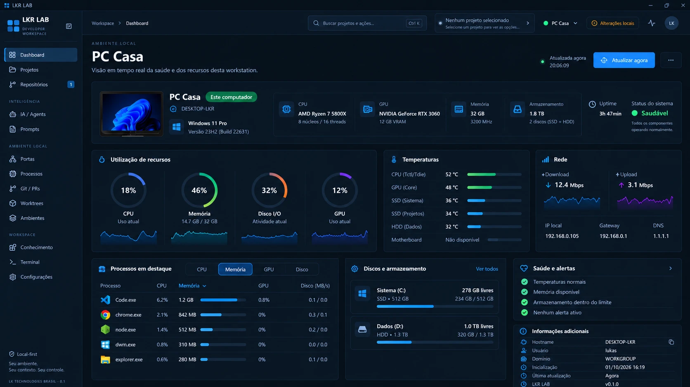

# Concept 02 — Dashboard da Máquina / Machine Health

**Status:** APROVADO (direção visual)
**Sessão DDAE:** [SESSION-001](../../ddae/sessions/SESSION-001-machine-context-workspace-foundation.md)
**Imagem canônica:** [concept-02-machine-health.webp](concept-02-machine-health.webp)
**Anterior:** [Concept 01](CONCEPT-01.md)

## Objetivo

Depois do cadastro da máquina, o Dashboard principal passa a representar a **saúde e os recursos da workstation atual**, e não mais um resumo genérico de projetos.

## Conteúdo do concept

- **Cabeçalho:** nome amigável da máquina como título, subtítulo "visão em tempo real da saúde e dos recursos desta workstation", indicação de última atualização, botão **Atualizar agora** e menu de ações.
- **Topbar:** breadcrumb Workspace › Dashboard e seletor da máquina atual (com indicador de status) ao lado do seletor de projeto.
- **Sidebar:** módulos liberados (sem cadeados), já que a máquina está cadastrada.
- **Identidade da máquina:** imagem/ilustração, nome amigável, selo "Este computador", hostname, sistema e versão.
- **Resumo de hardware:** CPU, GPU (VRAM), memória, armazenamento, uptime e status geral do sistema.
- **Utilização de recursos:** CPU, memória, disco I/O e GPU, com indicador circular e sparkline.
- **Temperaturas:** CPU, GPU, SSDs, HDD e motherboard (com estado "Não disponível" quando o sensor não existe).
- **Rede:** download, upload, IP local, gateway e DNS.
- **Processos em destaque:** ranking com abas CPU, Memória, GPU e Disco.
- **Discos e armazenamento:** volumes com espaço livre/usado.
- **Saúde e alertas:** checklist de condições e alertas ativos.
- **Informações adicionais:** hostname, usuário, domínio, inicialização, última atualização e versão do LKR LAB.

## Regras canônicas

1. O Dashboard principal é a visão da **máquina**, alinhado à hierarquia MACHINE → PROJECTS → PROJECT ([Concept 01](CONCEPT-01.md)).
2. Todo o conteúdo é **estado da máquina**: não é sincronizado entre instalações.
3. O snapshot segue o requisito de refresh: na inicialização, a cada 6 horas com o app aberto, via **Atualizar agora** e ao voltar de suspensão com o snapshot expirado. Sem polling pesado. A indicação de "Atualizada agora" no concept reflete o horário do último snapshot.
4. Sensores indisponíveis (ex.: temperatura da motherboard) devem ser mostrados como **Não disponível**, nunca inventados ou simulados.
5. O bloco **Consumo por processo** cobre CPU, RAM, GPU e Disco I/O.
6. O nome exibido é o nome amigável confirmado pelo usuário no cadastro; hostname, IP e hardware são atributos exibidos, não identidade.

> Nota: os valores do concept (CPU, temperaturas, processos, IPs etc.) são ilustrativos da referência visual, não dados reais nem contrato de campos. O concept sugere "tempo real", mas o requisito vigente é o snapshot com refresh de 6h, sem polling pesado. Isso fica para validação na implementação.

## Observações para a implementação futura

- Várias métricas (temperaturas, GPU, disco I/O por processo) dependem de fontes que podem não existir no host. Cada bloco precisa de estado "Não disponível" explícito.
- O bloco de Rede exibe IP local, gateway e DNS, que são atributos de máquina (ver fronteira no Concept 01).
- O item "Repositórios" na sidebar mostra um contador; a regra desse contador não foi definida.

## Próximo concept

**Concept 03 — Projetos** (aprovado, ver [CONCEPT-03](CONCEPT-03.md)).

## Fora de escopo

Este registro é documental. Nada aqui implementa o dashboard, coleta de métricas, banco, APIs ou bridge.
