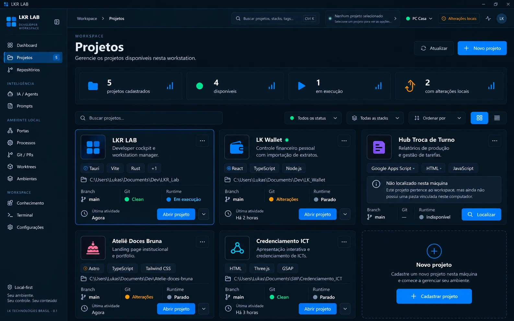

# Concept 03 — Projetos

**Status:** APROVADO (direção visual)
**Sessão DDAE:** [SESSION-001](../../ddae/sessions/SESSION-001-machine-context-workspace-foundation.md)
**Imagem canônica:** [concept-03-projects.webp](concept-03-projects.webp)
**Anterior:** [Concept 02](CONCEPT-02.md)

## Objetivo

Definir a página **Projetos**: a lista de projetos do workspace, na visão da máquina atual. É o segundo nível da hierarquia MACHINE → PROJECTS → PROJECT ([Concept 01](CONCEPT-01.md)).

## Conteúdo do concept

- **Cabeçalho:** breadcrumb Workspace › Projetos, título "Projetos", subtítulo "Gerencie os projetos disponíveis nesta workstation", ações **Atualizar** e **Novo projeto**.
- **Resumo:** projetos cadastrados, disponíveis, em execução e com alterações locais.
- **Barra de controle:** busca (nome, stack, tags), filtro de status, filtro de stack, ordenação e alternância entre grade e lista.
- **Card de projeto:** ícone, nome, descrição, stacks (com "+N" quando excede), path local, branch, estado Git (Clean / Alterações), runtime (Em execução / Parado / Indisponível), última atividade, botão **Abrir projeto** e menu de ações.
- **Card "Novo projeto":** CTA tracejado "Cadastrar projeto".
- **Projeto não localizado nesta máquina:** o card exibe aviso "Não localizado nesta máquina" (o projeto pertence ao workspace, mas não tem pasta vinculada neste computador), runtime "Indisponível", Git sem dado e o botão **Localizar** no lugar de "Abrir projeto".

## Regras canônicas

1. A lista é o conjunto de **projetos do workspace** vistos a partir da **máquina atual** (o seletor "PC Casa" na topbar indica o contexto).
2. **Projeto e vínculo local são coisas separadas.** O projeto é portátil; o path local é binding da máquina (ver fronteira no [Concept 01](CONCEPT-01.md), [STATE.md](../../STATE.md) e [ADR-004](../../adr/ADR-004-portable-state.md)). Um projeto pode existir no workspace sem estar vinculado nesta máquina.
3. Projeto sem pasta vinculada mostra o estado **Não localizado nesta máquina** e oferece **Localizar** (religar o caminho). Ele não pode ser aberto, e Git e runtime ficam indisponíveis.
4. Os resumos (cadastrados, disponíveis, em execução, com alterações locais) são derivados do estado real da máquina, nunca simulados.
5. Git, branch, stack e runtime vêm da inspeção automática da pasta (ver "Projetos" em [Concept 01](CONCEPT-01.md)), com valores ausentes exibidos como indisponíveis.
6. "Abrir projeto" entra no ambiente dedicado do projeto (Project Control Center, Concept 05).
7. O cadastro de um projeto novo (nome, descrição, path) é o tema do Concept 04.

> Nota: os valores do concept (nomes, paths, stacks, contagens) são ilustrativos da referência visual, não dados reais nem contrato de campos.

## Observações para a implementação futura

- A contagem "5" ao lado de Projetos na sidebar parece coincidir com o total de projetos; a regra do contador não foi definida (o mesmo vale para o contador de Repositórios, ver [Concept 02](CONCEPT-02.md)).
- O indicador verde ao lado do nome de um projeto ("LK Wallet") não está explicado no concept. Pode indicar algo como "em execução", mas o card mostra Runtime "Parado". A semântica precisa ser definida.
- "Disponíveis" (4 de 5) deve corresponder a projetos com pasta vinculada e acessível nesta máquina.
- Cards de runtime dependem do runtime manager já existente no projeto; o escopo exato fica para a implementação.

## Próximo concept

**Concept 04 — Cadastro de Projeto** (aprovado, ver [CONCEPT-04](CONCEPT-04.md)).

## Fora de escopo

Este registro é documental. Nada aqui implementa a página, o vínculo de path, banco, APIs ou bridge.
