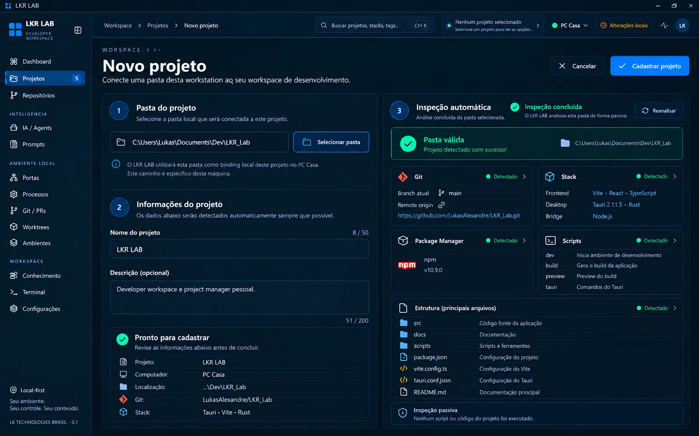

# Concept 04 — Cadastro de Projeto

**Status:** APROVADO (direção visual)
**Sessão DDAE:** [SESSION-001](../../ddae/sessions/SESSION-001-machine-context-workspace-foundation.md)
**Imagem canônica:** [concept-04-new-project.webp](concept-04-new-project.webp)
**Anterior:** [Concept 03](CONCEPT-03.md)

## Objetivo

Definir a página **Novo projeto**: conectar uma pasta desta workstation ao workspace de desenvolvimento, com inspeção automática e passiva da pasta.

## Conteúdo do concept

- **Cabeçalho:** breadcrumb Workspace › Projetos › Novo projeto, título "Novo projeto", subtítulo "Conecte uma pasta desta workstation ao seu workspace de desenvolvimento", ações **Cancelar** e **Cadastrar projeto**.
- **Passo 1 — Pasta do projeto:** campo de path e botão **Selecionar pasta**. Aviso de que o LKR LAB usa a pasta como **binding local deste projeto no computador atual** e que o caminho é específico desta máquina.
- **Passo 2 — Informações do projeto:** nome (com contador, 8/50) e descrição opcional (com contador, 51/200). Os dados são detectados automaticamente sempre que possível.
- **Resumo "Pronto para cadastrar":** projeto, computador, localização (path abreviado), Git e stack, para revisão antes de concluir.
- **Passo 3 — Inspeção automática:** status "Inspeção concluída", botão **Reanalisar**, banner "Pasta válida / Projeto detectado com sucesso" com o path, e blocos:
  - **Git:** branch atual e remote origin.
  - **Stack:** frontend, desktop e bridge detectados.
  - **Package Manager:** gerenciador e versão.
  - **Scripts:** scripts detectados com descrição curta.
  - **Estrutura (principais arquivos):** pastas e arquivos relevantes.
- **Rodapé "Inspeção passiva":** nenhum script ou código do projeto foi executado.

## Regras canônicas

1. O cadastro parte da **pasta**: selecionar o path primeiro, depois nome e descrição, que podem ser pré-preenchidos pela inspeção quando possível.
2. O path é **binding local desta máquina**, não parte do estado portátil do projeto (ver fronteira no [Concept 01](CONCEPT-01.md), [STATE.md](../../STATE.md) e [ADR-004](../../adr/ADR-004-portable-state.md)). Isso fecha a regra do [Concept 03](CONCEPT-03.md): o projeto pertence ao workspace e pode existir sem pasta vinculada em outra máquina.
3. O projeto é cadastrado **na máquina atual**: o resumo exibe o computador (ex.: PC Casa).
4. A inspeção é **passiva**: lê a estrutura e metadados da pasta (Git, stack, package manager, scripts, arquivos principais), mas **não executa scripts nem código do projeto**. Isso é coerente com a descoberta já existente no repositório (stack e remote seguro sem executar scripts).
5. Os scripts detectados são só **listados** com a descrição, e não executados no cadastro.
6. Campos que não puderem ser detectados aparecem como indisponíveis, nunca inventados.
7. Nome tem limite de 50 caracteres e descrição de 200, ambos com contador. Nome é obrigatório e a descrição é opcional.
8. A ação **Reanalisar** repete a inspeção passiva sem alterar nada.
9. **Cancelar** descarta o formulário sem criar projeto.

> Nota: os valores do concept (nome, paths, stack, remote, scripts) são ilustrativos da referência visual, não dados reais nem contrato de campos.

## Observações para a implementação futura

- O breadcrumb do título ("WORKSPACE › ›") parece truncado no concept; é apenas um detalhe visual a conferir.
- O concept mostra a descrição do projeto preenchida ("Developer workspace e project manager pessoal."). Não está definido se vem da inspeção (ex.: README ou `package.json`) ou de texto digitado pelo usuário.
- Cada bloco de inspeção tem uma seta de expansão; o conteúdo do detalhe não foi desenhado.
- Não está definido o comportamento quando a pasta já está cadastrada neste computador, ou quando já existe um projeto do workspace com o mesmo repositório em outra máquina (religar via **Localizar** em vez de duplicar).
- Não está definido o que acontece quando a pasta não é válida (sem Git, sem stack detectável).

## Próximo concept

**Concept 05 — Project Control Center** (aprovado, ver [CONCEPT-05](CONCEPT-05.md)).

## Fora de escopo

Este registro é documental. Nada aqui implementa o formulário, a inspeção, o vínculo de path, banco, APIs ou bridge.
