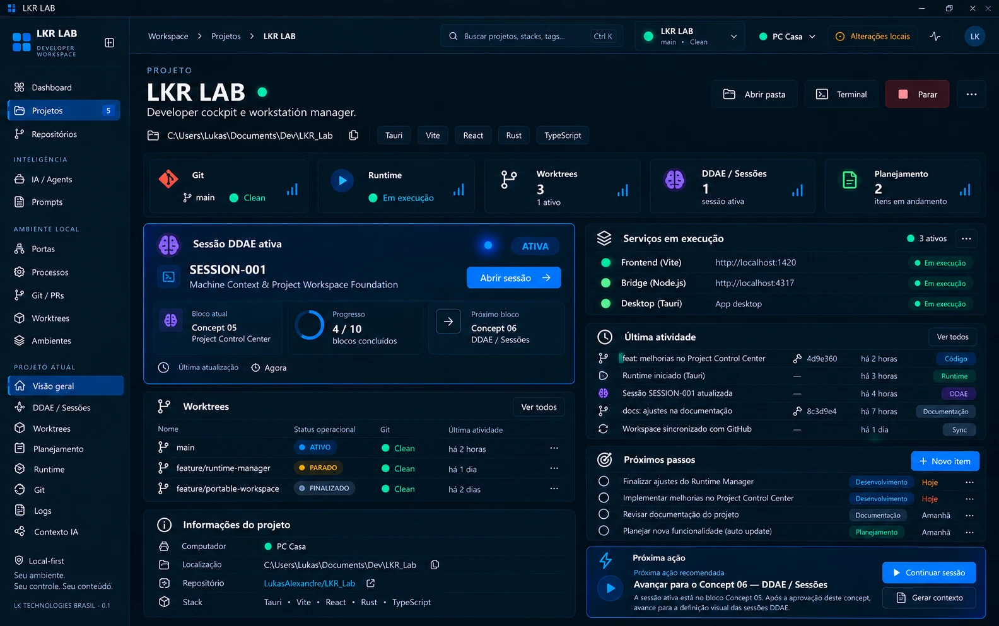

# Concept 05 — Project Control Center

**Status:** APROVADO (direção visual)
**Sessão DDAE:** [SESSION-001](../../ddae/sessions/SESSION-001-machine-context-workspace-foundation.md)
**Imagem canônica:** [concept-05-project-control-center.webp](concept-05-project-control-center.webp)
**Anterior:** [Concept 04](CONCEPT-04.md)

## Objetivo

Definir o ambiente dedicado de um projeto, aberto por "Abrir projeto" ([Concept 03](CONCEPT-03.md)): a **Visão geral** do Project Control Center. É o terceiro nível da hierarquia MACHINE → PROJECTS → PROJECT → DDAE / WORKTREES / PLANNING / RUNTIME ([Concept 01](CONCEPT-01.md)).

## Conteúdo do concept

- **Topbar:** breadcrumb Workspace › Projetos › LKR LAB, seletor do **projeto atual** (com branch e estado Git) e seletor da máquina (PC Casa). Com um projeto aberto, a topbar deixa de mostrar "Nenhum projeto selecionado".
- **Sidebar:** a navegação global continua, e surge a seção **Projeto atual** com: Visão geral, DDAE / Sessões, Worktrees, Planejamento, Runtime, Git, Logs e Contexto IA. É a estrutura prevista para o Project Control Center.
- **Cabeçalho do projeto:** nome, indicador de estado, descrição, path local (com copiar), stacks e as ações **Abrir pasta**, **Terminal**, **Parar** (ação do runtime) e menu.
- **Cards de resumo:** Git (branch e estado), Runtime (estado), Worktrees (total e quantos ativos), DDAE / Sessões (sessões ativas) e Planejamento (itens em andamento).
- **Sessão DDAE ativa:** selo ATIVA, ID e nome da sessão, bloco atual, progresso (X/10 blocos concluídos), próximo bloco, última atualização e as ações **Abrir sessão**.
- **Worktrees:** tabela com nome, status operacional (ATIVO, PARADO, FINALIZADO), estado Git e última atividade.
- **Informações do projeto:** computador, localização, repositório (com link) e stack.
- **Serviços em execução:** serviços do projeto com URL/porta e estado (ex.: Vite, Bridge, Desktop).
- **Última atividade:** linha do tempo com commits, runtime, sessão DDAE, documentação e sync, com origem rotulada (Código, Runtime, DDAE, Documentação, Sync).
- **Próximos passos:** lista de itens planejados com categoria, prazo e botão **Novo item**.
- **Próxima ação recomendada:** sugestão contextual derivada da sessão ativa, com **Continuar sessão** e **Gerar contexto**.

## Regras canônicas

1. A página responde "qual sessão, worktree, planejamento e runtime pertencem a este contexto?" para **um projeto em uma máquina**.
2. Navegação do projeto fica na seção **Projeto atual** da sidebar. As áreas são as do plano original: Visão Geral, DDAE / Sessões, Worktrees, Planejamento, Runtime, Git, Logs e Contexto IA.
3. A Visão geral é um **painel de síntese**: cada bloco resume uma área e leva a ela (DDAE → Concept 06 e 07, Worktrees → Concept 08, Planejamento → Concept 09).
4. O **status operacional** das worktrees (ATIVO, PARADO, FINALIZADO) é metadata do LKR LAB, não do Git, que aparece separado na coluna Git. Vale também o estado CONGELADO, previsto na [SESSION-001](../../ddae/sessions/SESSION-001-machine-context-workspace-foundation.md).
5. A sessão DDAE ativa usa o visual de estado **ATIVA** (cor viva, glow e pulsação discreta), conforme a direção definida na SESSION-001.
6. Runtime, Git, serviços e atividade são **estado real da máquina**, derivados e nunca simulados. Informação indisponível aparece como indisponível.
7. **Parar** e outras ações de runtime exigem as confirmações já previstas no runtime manager do projeto.
8. A "Próxima ação" recomendada é derivada da sessão DDAE ativa e do roadmap, como no exemplo (avançar para o próximo bloco). **Gerar contexto** alimenta o Contexto IA.
9. Os próximos passos são itens de **Planejamento** (Concept 09), com a ligação futura item planejado → Session DDAE.

> Nota: os valores do concept (nomes, hashes, horários, contagens, URLs) são ilustrativos da referência visual, não dados reais nem contrato de campos. O progresso "4 / 10" mostrado no concept também é ilustrativo e não reflete o estado real da SESSION-001.

## Observações para a implementação futura

- O concept usa o **próprio LKR LAB e a SESSION-001** como exemplo de dados, o que mostra a sessão ativa do DDAE no card.
- O indicador verde ao lado do nome do projeto (já visto no Concept 03) provavelmente significa "em execução". A semântica ainda precisa ser confirmada.
- A relação entre "Serviços em execução" e o runtime manager já existente no repositório precisa ser definida na implementação.
- O que acontece ao abrir esta página para um projeto **não localizado nesta máquina** (Concept 03) não foi desenhado.
- Não estão definidos os critérios de "disponível" ou "em andamento" nos cards de resumo.
- O contador de Projetos na sidebar (5) continua sem regra definida.

## Próximo concept

**Concept 06 — DDAE / Sessões** (aprovado, ver [CONCEPT-06](CONCEPT-06.md)).

## Fora de escopo

Este registro é documental. Nada aqui implementa o Project Control Center, a sidebar de projeto, sessões, runtime, banco, APIs ou bridge.
