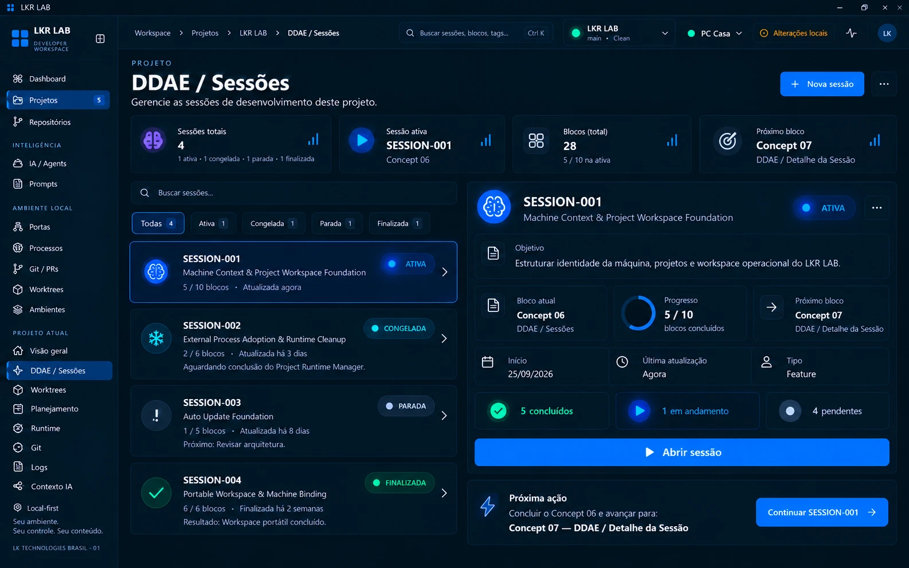

# Concept 06 — DDAE / Sessões

**Status:** APROVADO (direção visual)
**Sessão DDAE:** [SESSION-001](../../ddae/sessions/SESSION-001-machine-context-workspace-foundation.md)
**Imagem canônica:** [concept-06-ddae-sessions.webp](concept-06-ddae-sessions.webp)
**Anterior:** [Concept 05](CONCEPT-05.md)

## Objetivo

Definir a página **DDAE / Sessões** dentro do Project Control Center: a lista das sessões de desenvolvimento do projeto, com seus estados operacionais.

## Conteúdo do concept

- **Topbar:** breadcrumb Workspace › Projetos › LKR LAB › DDAE / Sessões, busca de sessões, blocos e tags, seletores de projeto e máquina.
- **Sidebar:** item **DDAE / Sessões** ativo na seção Projeto atual.
- **Cabeçalho:** título "DDAE / Sessões", subtítulo "Gerencie as sessões de desenvolvimento deste projeto", ações **Nova sessão** e menu.
- **Cards de resumo:** sessões totais (com a quebra por estado), sessão ativa (ID e bloco atual), blocos (total e quantos na sessão ativa) e próximo bloco.
- **Lista de sessões:** busca e filtros por estado (Todas, Ativa, Congelada, Parada, Finalizada, cada um com contador). Cada item mostra ID, nome, estado, progresso em blocos, última atualização e uma linha de contexto (motivo da pausa, próximo passo ou resultado).
- **Detalhe da sessão selecionada:** ID, nome, estado, objetivo, bloco atual, progresso, próximo bloco, início, última atualização, tipo, contagem de blocos (concluídos, em andamento, pendentes), **Abrir sessão** e menu.
- **Próxima ação:** sugestão contextual com **Continuar SESSION-001**.

## Regras canônicas

1. Uma sessão DDAE pertence a um **projeto** e se organiza em **blocos**.
2. Quatro estados operacionais, como definido na SESSION-001, cada um com visual próprio:

   | Estado | Visual no concept |
   |--------|-------------------|
   | ATIVA | azul vivo, glow, ponto pulsante, card destacado |
   | CONGELADA | frio (ciano/gelo), estático, ícone de floco |
   | PARADA | neutro, pouco destaque, ícone de alerta |
   | FINALIZADA | verde resolvido, estático, ícone de check |

3. A linha de contexto de cada card explica **por que** a sessão está no estado atual: motivo do congelamento, próximo passo da parada ou resultado da finalizada.
4. Os filtros por estado mostram contador por estado. A soma deve bater com as sessões totais.
5. O detalhe resumido ao lado leva ao **Concept 07** (DDAE / Detalhe da Sessão) por **Abrir sessão**.
6. **Nova sessão** cria uma sessão DDAE para o projeto. O fluxo de criação não foi desenhado.
7. As sessões do concept seguem o formato `SESSION-NNN` com nome em inglês, como na [SESSION-001](../../ddae/sessions/SESSION-001-machine-context-workspace-foundation.md).
8. Estados e progresso são metadata operacional do LKR LAB, não dados do Git.

> Nota: os valores do concept (SESSION-002 a SESSION-004, datas, contagens) são ilustrativos da referência visual, não dados reais nem contrato de campos. Os números da SESSION-001 também são ilustrativos: o concept mostra "Concept 06" como bloco atual e "5 / 10" de progresso, enquanto o estado real do registro é outro.

## Observações para a implementação futura

- O concept mostra "Blocos (total): 28", somando os blocos de todas as sessões, mas as sessões ilustradas somam 10 + 6 + 5 + 6 = 27. A regra de contagem precisa ser definida.
- A transição de **ATIVA** para **CONGELADA** ou **PARADA** (e a diferença operacional entre as duas) não está definida. O concept sugere congelada = aguardando algo externo e parada = sem retomada imediata, mas isso precisa ser confirmado.
- Não está definido se pode existir mais de uma sessão ATIVA por projeto. O concept mostra uma só ("Sessão ativa").
- O vínculo entre a sessão e as worktrees (Concept 08) e os itens de planejamento (Concept 09) não aparece aqui.
- Os contadores de sidebar continuam sem regra definida.
- O formato de armazenamento da sessão (arquivo Markdown em `docs/ddae/sessions/` ou banco) é decisão de implementação.

## Próximo concept

**Concept 07 — DDAE / Detalhe da Sessão** (aprovado, ver [CONCEPT-07](CONCEPT-07.md)).

## Fora de escopo

Este registro é documental. Nada aqui implementa a página, os estados, a criação de sessões, banco, APIs ou bridge.
