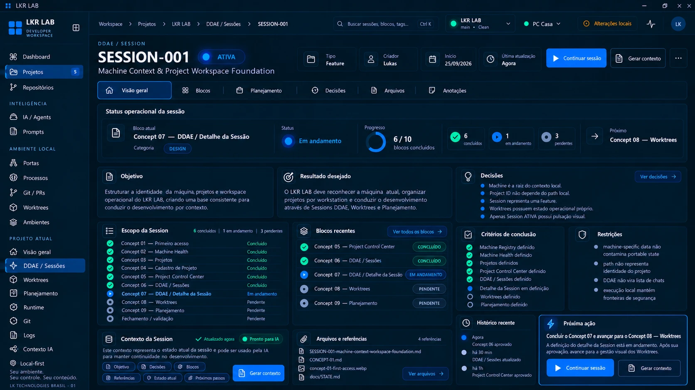

# Concept 07 — DDAE / Detalhe da Sessão

**Status:** APROVADO (direção visual)
**Sessão DDAE:** [SESSION-001](../../ddae/sessions/SESSION-001-machine-context-workspace-foundation.md)
**Imagem canônica:** [concept-07-ddae-session-detail.webp](concept-07-ddae-session-detail.webp)
**Anterior:** [Concept 06](CONCEPT-06.md)

## Objetivo

Definir a página de **detalhe de uma sessão DDAE**, aberta por "Abrir sessão" ([Concept 06](CONCEPT-06.md)). Ela é o painel de trabalho da sessão: estado operacional, escopo em blocos, decisões, critérios, restrições, arquivos e contexto para IA.

## Conteúdo do concept

- **Topbar:** breadcrumb Workspace › Projetos › LKR LAB › DDAE / Sessões › SESSION-001.
- **Cabeçalho:** rótulo "DDAE / Session", ID e nome da sessão, selo de estado (ATIVA), tipo, criador, início, última atualização e as ações **Continuar sessão**, **Gerar contexto** e menu.
- **Abas:** Visão geral, Blocos, Planejamento, Decisões, Arquivos e Anotações.
- **Status operacional da sessão:** bloco atual com categoria (ex.: Design), status do bloco, progresso em blocos concluídos, contagem de concluídos, em andamento e pendentes, e o próximo bloco.
- **Objetivo** e **Resultado desejado** da sessão.
- **Decisões:** lista resumida das decisões da sessão, com link "Ver decisões".
- **Escopo da Session:** lista completa dos blocos com seu estado, incluindo um bloco final de **Fechamento / validação**.
- **Blocos recentes:** últimos blocos com selo de estado e link "Ver todos os blocos".
- **Critérios de conclusão:** checklist do que precisa estar definido para finalizar a sessão.
- **Restrições:** limites que a sessão deve respeitar.
- **Contexto da Session:** indicador de contexto atualizado e "Pronto para IA", com as seções que o compõem (Objetivo, Decisões, Blocos, Referências, Estado atual, Próximos passos) e a ação **Gerar contexto**.
- **Arquivos e referências:** arquivos ligados à sessão (a própria sessão, os concepts, `docs/STATE.md`) com "Ver arquivos".
- **Histórico recente:** linha do tempo de eventos da sessão.
- **Próxima ação:** recomendação contextual com **Continuar sessão** e **Gerar contexto**.

## Regras canônicas

1. A sessão é a unidade de trabalho de **uma feature**: o concept registra "Session representa uma Feature".
2. A sessão se organiza em **blocos**, cada um com estado (Concluído, Em andamento, Pendente) e categoria. Existe um bloco de fechamento / validação ao final.
3. As **decisões** da sessão ficam registradas na própria sessão (ver "Decisões de arquitetura registradas" na [SESSION-001](../../ddae/sessions/SESSION-001-machine-context-workspace-foundation.md)).
4. **Critérios de conclusão** e **restrições** fazem parte da sessão. As restrições do concept reforçam as regras já registradas:
   - dado específico da máquina não contamina o estado portátil ([Concept 01](CONCEPT-01.md), [STATE.md](../../STATE.md));
   - o path não representa a identidade do projeto;
   - o DDAE não vira lista de chats;
   - a execução local mantém as fronteiras de segurança.
5. Decisões registradas no concept: a máquina é a raiz do contexto local; o Project ID não depende do path local; a sessão representa uma feature; as worktrees possuem estado operacional próprio; apenas a sessão ATIVA tem pulsação visual.
6. **Gerar contexto** produz um contexto da sessão utilizável por IA, a partir de objetivo, decisões, blocos, referências, estado atual e próximos passos. Ele não envia nada a nenhum serviço externo por si só.
7. O estado visual segue a direção da SESSION-001: ATIVA com cor viva, glow e pulsação; as demais estáticas.
8. Estados e progresso são metadata operacional do LKR LAB.

> Nota: os valores do concept (datas, horários, criador, "há 30 min", etc.) são ilustrativos da referência visual, não dados reais nem contrato de campos. O progresso mostrado (6 / 10, Concept 07 em andamento) é coerente com o estado do registro nesta sessão, mas o "bloco em andamento" é só um exemplo de como a página se comporta.

## Observações para a implementação futura

- **Project ID não depende do path local** é uma decisão nova que aparece no concept. Ela complementa o [Concept 03](CONCEPT-03.md) e o [Concept 04](CONCEPT-04.md) (path é binding da máquina), mas não define como o Project ID é gerado nem onde fica guardado. Precisa de decisão e provavelmente de uma ADR antes da implementação.
- O concept mostra o bloco atual como "Em andamento" e a sessão **ATIVA**. Ainda não está definido quem altera o estado de um bloco (manual, automático ou por IA).
- As abas **Blocos, Planejamento, Decisões, Arquivos e Anotações** não foram desenhadas; só a Visão geral existe.
- **Anotações** não tem escopo definido (notas livres da sessão?).
- "Pronto para IA" precisa de critério: o que torna o contexto atualizado e pronto, e onde é gerado.
- O formato de armazenamento da sessão (Markdown em `docs/ddae/sessions/` ou banco) segue sem decisão.
- Não está definido se **Planejamento** dentro da sessão é o mesmo conteúdo do Concept 09 filtrado pela sessão, ou algo próprio.
- O detalhe da sessão é mostrado só no estado ATIVA. Faltam as variações para CONGELADA, PARADA e FINALIZADA (ações disponíveis, como retomar ou reabrir).

## Próximo concept

**Concept 08 — Worktrees** (aprovado, ver [CONCEPT-08](CONCEPT-08.md)).

## Fora de escopo

Este registro é documental. Nada aqui implementa a página, o gerador de contexto, banco, APIs ou bridge.
