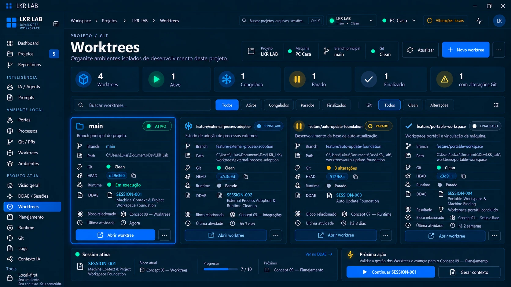

# Concept 08 — Worktrees

**Status:** APROVADO (direção visual)
**Sessão DDAE:** [SESSION-001](../../ddae/sessions/SESSION-001-machine-context-workspace-foundation.md)
**Imagem canônica:** [concept-08-worktrees.webp](concept-08-worktrees.webp)
**Anterior:** [Concept 07](CONCEPT-07.md)

## Objetivo

Definir a página **Worktrees** do Project Control Center: a gestão visual dos ambientes isolados de desenvolvimento do projeto, ligando cada worktree ao seu estado operacional, Git, runtime e sessão DDAE.

## Conteúdo do concept

- **Topbar:** breadcrumb Workspace › Projetos › LKR LAB › Worktrees. Rótulo da página "Projeto / Git".
- **Cabeçalho:** título "Worktrees", subtítulo "Organize ambientes isolados de desenvolvimento deste projeto", e um resumo de contexto com projeto, máquina, branch principal e estado Git, mais as ações **Atualizar**, **Novo worktree** e menu.
- **Cards de resumo:** total de worktrees e a contagem por estado operacional (Ativo, Congelado, Parado, Finalizado), mais quantas têm alterações Git.
- **Filtros:** busca, filtro por estado operacional (Todos, Ativos, Congelados, Parados, Finalizados) e filtro por Git (Todos, Clean, Alterações).
- **Card de worktree:** nome (branch), descrição, branch, path, estado Git, HEAD (com copiar), runtime, **sessão DDAE** vinculada, bloco relacionado, última atividade e as ações **Abrir worktree** e menu. Worktrees finalizadas mostram também o **resultado**.
- **Worktree principal:** `main` aparece como a primeira worktree, descrita como branch principal do projeto, com o runtime em execução.
- **Sessão ativa:** rodapé com a sessão DDAE ativa, bloco atual, progresso e próximo bloco.
- **Próxima ação:** recomendação contextual com **Continuar SESSION-001** e **Gerar contexto**.

## Regras canônicas

1. O **estado operacional** das worktrees (ATIVO, CONGELADO, PARADO, FINALIZADO) é **metadata do LKR LAB**. O Git não possui esses conceitos e eles não são apresentados como se possuísse. O estado Git (Clean / Alterações, HEAD, branch) é uma coluna separada.
2. Os estados espelham os das sessões DDAE ([Concept 06](CONCEPT-06.md)), cada um com visual próprio (ATIVO vivo e em destaque; CONGELADO frio; PARADO âmbar; FINALIZADO neutro e resolvido). Apenas a sessão ou worktree ATIVA tem destaque visual forte.
3. Cada worktree se **vincula a uma sessão DDAE** e a um **bloco relacionado** dessa sessão. É a ligação entre o plano de trabalho (DDAE) e o ambiente de código (Git).
4. O **path** da worktree é binding desta máquina ([Concept 01](CONCEPT-01.md), [Concept 04](CONCEPT-04.md)). O estado operacional, o vínculo com a sessão e o resultado podem ser portáveis; o path, o HEAD e o estado Git são da máquina.
5. Git (Clean / Alterações, HEAD) e runtime são **leitura do estado real**, nunca simulados. A visão de worktrees já existe hoje em leitura no projeto; criar e remover worktrees continuam sendo escopo futuro do roadmap.
6. **Novo worktree** cria uma worktree vinculada a uma sessão. O fluxo de criação não foi desenhado e deve respeitar a regra do roadmap de verificar alterações e pedir confirmação antes de remover.
7. **Abrir worktree** abre o ambiente da worktree (pasta, terminal ou editor).
8. A página mostra o **contexto da sessão ativa** e a próxima ação, como na Visão geral do [Concept 05](CONCEPT-05.md).

> Nota: os valores do concept (nomes de branches, paths, hashes, datas, nomes de blocos relacionados como "Integrações" e "Runtime") são ilustrativos da referência visual, não dados reais nem contrato de campos. O progresso "7 / 10" é coerente com o estado do registro, contando os concepts 01 a 07 concluídos e o 08 em andamento.

## Observações para a implementação futura

- **Contagem de blocos:** o concept conta o progresso 7 / 10 sobre os 9 concepts mais um bloco de **Fechamento / validação** (como no [Concept 07](CONCEPT-07.md)), sem o bloco "Product Architecture". A tabela de blocos da SESSION-001 tem outra contagem (10 itens, com Product Architecture e sem Fechamento). A regra de progresso precisa ser unificada.
- **`main` como worktree:** o concept trata a `main` como uma worktree com estado operacional. Falta definir se a worktree principal é sempre ATIVA, se pode ser congelada ou parada, e se os estados são derivados da sessão vinculada ou definidos à parte.
- **Estado herdado ou independente:** não está definido se o estado da worktree acompanha o da sessão (ex.: sessão finalizada implica worktree finalizada) ou se são independentes. O concept mostra os dois em sincronia.
- **Relação 1:1 ou N:N:** o concept mostra uma sessão por worktree. Não está definido se uma sessão pode ter várias worktrees ou o contrário.
- **Onde ficam os metadados:** o estado operacional, o vínculo e o resultado não existem no Git. Falta decidir onde guardá-los (banco local, arquivo portátil, ou ambos).
- **Worktrees com alterações Git:** o concept destaca um card com "3 alterações" em uma worktree PARADA. Falta definir se isso gera alerta ou bloqueia finalizar.
- **Variações:** não foram desenhados estados vazios (projeto sem worktrees além da `main`), erro de leitura Git e worktree cujo path não existe nesta máquina.

## Próximo concept

**Concept 09 — Planejamento** (em refinamento, ver [CONCEPT-09](CONCEPT-09.md)). É o último concept do roadmap.

## Fora de escopo

Este registro é documental. Nada aqui implementa a página, a criação ou remoção de worktrees, metadata operacional, banco, APIs ou bridge.
