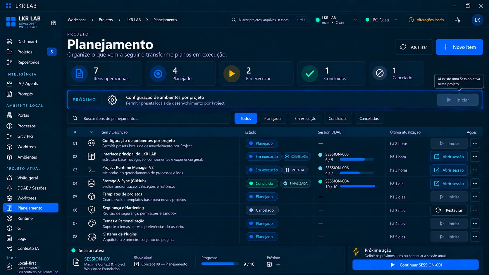

# Concept 09 — Planejamento

**Status:** IMPLEMENTADO E VALIDADO NO DESKTOP
**Sessão DDAE:** [SESSION-001](../../ddae/sessions/SESSION-001-machine-context-workspace-foundation.md)
**Imagem canônica:** [concept-09-planning.webp](concept-09-planning.webp)
**Especificação refinada:** [CONCEPT-09-planning-refinement](../../ddae/audits/CONCEPT-09-planning-refinement.md)
**Anterior:** [Concept 08](CONCEPT-08.md)

## Objetivo

Definir a página **Planejamento** do Project Control Center: uma fila ordenada e leve de features ainda não iniciadas, que se transformam em Sessions DDAE quando iniciadas. Planejamento responde **"O que vem depois?"**; o DDAE responde **"O que estamos executando agora?"**.

Cadeia canônica: **Planning Item → Session DDAE → Worktree → Runtime / Git → Session concluída → Planning Item concluído.**

## Versão final aprovada

A imagem canônica substitui a primeira direção visual (que tinha Backlog, Prioridade, Área, responsável, "Mais filtros", 12 itens e a mesma SESSION-001 em seis itens). A versão aprovada possui:

- **Resumo operacional derivado:** 7 itens operacionais, 4 planejados, 2 em execução, 1 concluído; o **cancelado (1) fica separado** e fora do total operacional.
- **Bloco PRÓXIMO:** o primeiro item planejado da fila, com o CTA **Iniciar**. Com Session ativa no Project, o CTA fica **desabilitado** com a explicação "Já existe uma Session ativa neste projeto."
- **Fila ordenada** em tabela única (#, Item / Descrição, Estado, Session DDAE, Última atualização, Ações), **sem drag handles**, **sem prioridade**, **sem responsável**.
- **Estados derivados:** PLANEJADO, EM EXECUÇÃO (com subbadge ATIVA / CONGELADA / PARADA), CONCLUÍDO (com FINALIZADA) e CANCELADO. **PARADA usa slate.**
- **Vínculo com a Session:** `SESSION-NNN` com progresso real (ex.: SESSION-005 6/9 CONGELADA, SESSION-006 4/7 PARADA, SESSION-004 10/10 FINALIZADA). CTA **Abrir sessão** para itens com Session; **Restaurar** para o cancelado.
- **Todos os "Iniciar" desabilitados** enquanto houver Session ativa no Project.
- **Filtros:** Todos, Planejados, Em execução, Concluídos, Cancelados. **Sem "Mais filtros".** **Novo item** sem dropdown.
- **Rodapé separado em dois blocos:** **Session ativa** (SESSION-001, bloco atual Concept 09 — Planejamento, 9/10) e **Próxima ação** ("Continuar SESSION-001"), que vem do Project Control Center e é independente do PRÓXIMO do Planejamento.

> Os valores do concept (itens, SESSION-004/005/006, horários, contagens) são **ilustrativos** da referência visual. Nenhum desses itens ou sessões existe no banco real e **não serão criados**. A SESSION-001 é uma Session legada real e **não** nasceu do Planejamento: não possui Planning Item.

## Regras canônicas

1. Planning Item pertence a **1 Project**. Campos: `id`, `project_id`, `title`, `description`, `position`, `stored_status` (`open | cancelled`), `cancel_reason?`, `created_at`, `updated_at`, `cancelled_at?`.
2. **Estados derivados, nunca persistidos:** planejado (open sem Session), em execução (Session `active | frozen | stopped`), concluído (Session `completed`). Persistem apenas `open` e `cancelled`.
3. **O vínculo mora na Session:** `ddae_sessions.planning_item_id` (nullable), com índice único parcial. 1 item : 0..1 Session; 1 Session : 0..1 item. SESSION = FEATURE.
4. **Sem prioridade:** a ordem manual da fila é a prioridade prática. Operações: mover para cima, para baixo e ao topo. Reordenar não gera evento. Sem drag-and-drop no MVP.
5. **Iniciar não cria Session silenciosamente:** abre o formulário de Nova Session pré-preenchido (título ← título do item; objetivo ← descrição); o usuário revisa e confirma.
6. **Uma Session ACTIVE por Project:** com Session ativa, Iniciar fica desabilitado. Não congela nem cria Session congelada automaticamente.
7. **Concluir não é ação:** Session `completed` torna o item CONCLUÍDO (derivado).
8. **Cancelar** só para item sem Session; cancelado não entra no total operacional, é restaurável e não pode ser iniciado. **Não existe exclusão destrutiva.**
9. **PRÓXIMO ≠ Próxima ação:** PRÓXIMO é do Planejamento (primeiro planejado da fila, mesmo com Iniciar desabilitado); Próxima ação é do Project Control Center.
10. Metadata **operacional do LKR LAB** (classe B, portátil, pertence ao Project): nunca path, Machine ID, hostname ou IP. Não há relação direta Planning ↔ Worktree (Planning → Session → Worktree).
11. Não é Jira/Trello: sem épicos, sprints, tags, área, responsável ou milestones.

## Estado atual

Concept 09 está **APROVADO VISUALMENTE** e **implementado** (migration 010, módulo `hub-core::planning`, workspace v5, página `#project/<id>/planning`, Project Control Center, Próxima ação, DDAE e Session Detail), coberto por testes automatizados. Foi **validado no desktop**: manualmente pelo usuário com os dados reais (estado vazio, SESSION-001, Próxima ação e Visão geral) e, no app Tauri real, em um banco isolado descartável para todos os estados e mutações; o hub.db real permaneceu intacto. Detalhes e limitações no bloco D07 da [SESSION-001](../../ddae/sessions/SESSION-001-machine-context-workspace-foundation.md). SESSION-001 permanece **ATIVA** (9/10, bloco atual Concept 09 — Planejamento); o Block não é concluído por esta implementação.
